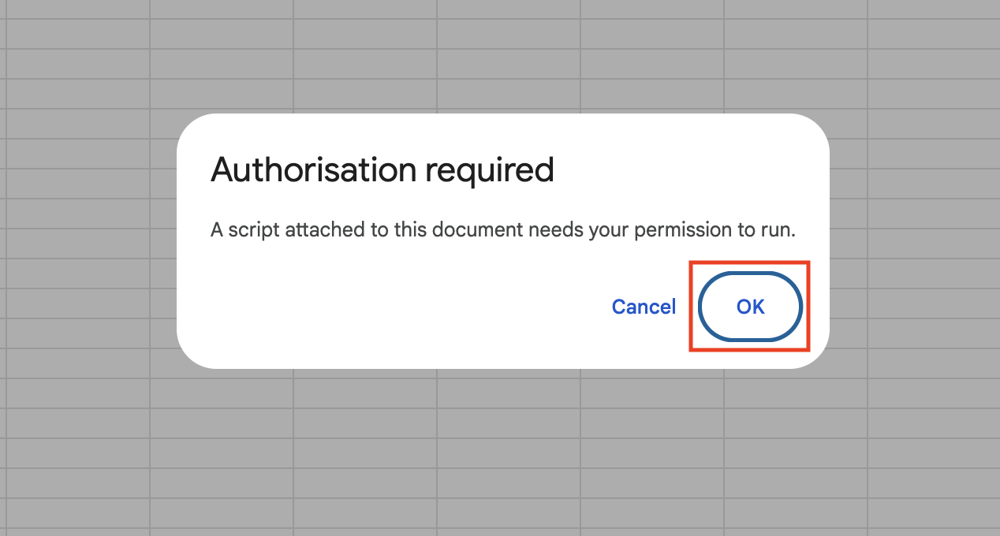

In this file, we describe how to simplify interaction with [Google Sheets](https://workspace.google.com/products/sheets/) by creating **macros** — functions written in [**Apps Script**](https://developers.google.com/apps-script) (a JavaScript-based language by Google).

## Copy existing scripts

Some useful macros are already implemented in the file `./stnd/run_from_csv/gsheet_macros.js`.

To use these macros in your Google Sheet:

1. Go to **Extensions → Apps Script** (this will open the script editor).
2. Copy the code from the `.js` file mentioned above and paste it into the script editor.

This will make the macros available in your Google Sheet.

## Load macros

Once the `.js` file is copied, you can load macros from it by following these steps:

1. Go to **Extensions → Macros → Import Macro**.
2. Click **Add function** next to the macro you want to add.

The first time you run a macro in a new Google Sheet, you will need to authorize it. For that, click **Advanced settings → Go to project (unsafe) → Continue**. See screenshots in toggle list below for more details.

Screenshots for Authorizing Apps Script file

## Example macros

Below, we describe how to use some of the most useful macros. You can also write your own macros or experiment with already existing ones not covered in this tutorial.

Before looking into examples please take a look at the [Quick Start Guide](../quick_start_guide/QUICK_START_GUIDE.md) to understand the key concepts, such as the **results table** and experiments-rows mapping in it.

### Expand rows

To avoid manually typing out experiment rows that can be generated by taking the Cartesian product of multiple argument values, you can use the **`expandRows`** macro as described below.

#### Table preparation

First, import the macro into your available macros as explained in the [Load Macros](#load-macros) section.

Second, create a row in your results table and specify sequences for the arguments you want to expand using the following notations:

- **List Expansion:**
  Use curly braces with values separated by `|`, for example:
  `{Hello | Bye}`
  > **Note:** This uses the `|` separator (unlike [list notation here](../reference/REFERENCE.md#reference-table), where a space is used).

- **Range Expansion:**
  Use angle brackets with the following format:
  `<start end step is_log>`
  - `start` — starting value (inclusive)
  - `end` — ending value (inclusive)
  - `step` — increment (or multiplier)
  - `is_log` — `True` for logarithmic spacing (`current *= step`), `False` for linear spacing (`current += step`)

Let's start with the following experiment rows:

| whether_to_run | path_to_main    | path_to_default_config | delta:input_str    | delta:learning_rate              | delta:random_seed          |
|----------------|-----------------|------------------------|--------------------|----------------------------------|----------------------------|
| 0              | example_main.py | example_config.yml     | First row          | 1                                | 1                          |
| 0              | example_main.py | example_config.yml     | {Hello &#124; Bye} | {<1e-6 0.0001 10 True>}     | {<1 3 1 False>}            |
| 0              | example_main.py | example_config.yml     | Last row           | 1                                | 4                          |

#### Table expansion

Now we are ready to expand the rows, for that you need:
- Select the row you want to expand (in this case, the second row).
- Run the `expandRows` macro from **Extensions → Macros → expandRows**.

The macro will automatically generate all combinations from the Cartesian product of your specified sequences and insert them as new rows below, without overwriting any existing rows.

The updated results table after expansion will look as follows:

| whether_to_run | path_to_main    | path_to_default_config | delta:input_str    | delta:learning_rate | delta:random_seed |
|----------------|-----------------|------------------------|--------------------|----------------------|-------------------|
| 0              | example_main.py | example_config.yml     | First row          | 1                    | 1                 |
| 0              | example_main.py | example_config.yml     | {Hello &#124; Bye} | {<1e-6 0.0001 10 True>} | {<1 3 1 False>} |
| 0              | example_main.py | example_config.yml     | Hello              | 0.000001             | 1                 |
| 0              | example_main.py | example_config.yml     | Hello              | 0.000001             | 2                 |
| 0              | example_main.py | example_config.yml     | Hello              | 0.000001             | 3                 |
| 0              | example_main.py | example_config.yml     | Hello              | 0.00001              | 1                 |
| 0              | example_main.py | example_config.yml     | Hello              | 0.00001              | 2                 |
| 0              | example_main.py | example_config.yml     | Hello              | 0.00001              | 3                 |
| 0              | example_main.py | example_config.yml     | Hello              | 0.0001               | 1                 |
| 0              | example_main.py | example_config.yml     | Hello              | 0.0001               | 2                 |
| 0              | example_main.py | example_config.yml     | Hello              | 0.0001               | 3                 |
| 0              | example_main.py | example_config.yml     | Bye                | 0.000001             | 1                 |
| 0              | example_main.py | example_config.yml     | Bye                | 0.000001             | 2                 |
| 0              | example_main.py | example_config.yml     | Bye                | 0.000001             | 3                 |
| 0              | example_main.py | example_config.yml     | Bye                | 0.00001              | 1                 |
| 0              | example_main.py | example_config.yml     | Bye                | 0.00001              | 2                 |
| 0              | example_main.py | example_config.yml     | Bye                | 0.00001              | 3                 |
| 0              | example_main.py | example_config.yml     | Bye                | 0.0001               | 1                 |
| 0              | example_main.py | example_config.yml     | Bye                | 0.0001               | 2                 |
| 0              | example_main.py | example_config.yml     | Bye                | 0.0001               | 3                 |
| 0              | example_main.py | example_config.yml     | Last row           | 1                    | 4                 |

**What happens:**

- `{<1e-6 0.0001 10 True>}` is parsed into the list `[1e-6, 1e-5, 1e-4]`.
- `{<1 3 1 False>}` is parsed into `[1, 2, 3]`.
- `{Hello | Bye}` is parsed into `[Hello, Bye]`.

Then, the **Cartesian product** is computed across:
- `delta:input_str → [Hello, Bye]`
- `delta:learning_rate → [1e-6, 1e-5, 1e-4]`
- `delta:random_seed → [1, 2, 3]`

This generates all possible combinations of these values into separate experiment rows.

This way, you can quickly generate large experiment configurations with minimal manual work.
