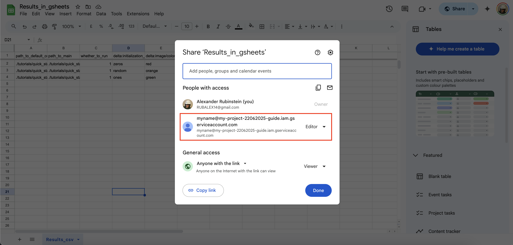

This tutorial demonstrates how to synchronize the results table with a [Google Sheet](https://workspace.google.com/products/sheets/) and optionally upload the default config, stdout, and stderr logs to [Google Drive](https://drive.google.com/drive/my-drive).

## Preliminaries

### Be aware of the quick start guide

Before starting this tutorial, make sure you:

- Understand the gist of [Quick Start Guide](../quick_start_guide/QUICK_START_GUIDE.md).
- Have an [Anaconda](https://www.anaconda.com/) environment with the `stnd` package installed as described [here](../../README.md#installation).

### Prepare service account for Google Sheets and Docs

To write to remote Google Sheets or Drive, you need to create a service account that will handle the writes and have the necessary authorization. For that, please perform these steps:

1. Go to [Google Cloud Console](https://console.cloud.google.com/projectselector2/apis/dashboard)
2. Create a new project
   <details>
   <summary>Screenshot for "Create Project"</summary>
   
   </details>
3. [Enable API access](https://docs.gspread.org/en/latest/oauth2.html#enable-api-access) for the following APIs:
- Google Sheets API
- Google Drive API (repeat the same steps as for Google Sheets, but for Google Drive)

    <details>
    <summary>Screenshot for "Enabling APIs"</summary>
    
    </details>
    <details>
    <summary>Screenshot for "Enabling Google Sheet API"</summary>
    
    
    </details>

4. Navigate to the **Credentials** section

    <details>
    <summary>Screenshot for "Credentials section"</summary>
    
    </details>

5. Click **"Create credentials"** → **Service account**

    <details>
    <summary>Screenshot for "Create service account"</summary>
    
    </details>

6. Select newly created Service Account in “Service Accounts” section of credentials page.

    <details>
    <summary>Screenshot for "Selecting new service account"</summary>
    
    </details>

7. Remember its name e.g. myname@my-project-22062025-guide.iam.gserviceaccount.com in the example screenshot above.
8. Select newly created Service → go to tab Keys of the service page → Add key → Download key as JSON

    <details>
    <summary>Screenshots for "Creating credentials json"</summary>
    
    
    
    </details>

9. Put the downloaded json with credentials inside `~/.config/gauth/service_key.json`

## Moving results table to Google Sheets

Now we are ready to synchronize results table with remote Google Sheets. For demonstration purposes we created a copy of [results.csv](../quick_start_guide/results.csv) in Google Sheets [by this link](https://docs.google.com/spreadsheets/d/1vfwGoh_5Nb0t0-Ohcj42jhOakgbyB6w4mlnt3lbskAc/edit?gid=0#gid=0). Please make a copy of it and share access to it with the service account created in step 7 in the [previous section](#prepare-service-account-for-google-sheets-and-docs).

<details>
<summary>Screenshot for "Sharing google sheet with service account"</summary>

</details>

Create a string in the format: `<link to google sheet>::<name of the worksheet>`

For example: `https://docs.google.com/spreadsheets/d/1vfwGoh_5Nb0t0-Ohcj42jhOakgbyB6w4mlnt3lbskAc/edit?gid=0#gid=0::Results_csv`. If the worksheet name contains spaces, wrap the entire string in quotes before using it in the terminal.

Use this string instead of the CSV path in the [command from quick start guide](../quick_start_guide/QUICK_START_GUIDE.md#run-experiment):

```
export ENV=<your env> && export PROJECT_ROOT_PROVIDED_FOR_STUNED=<repo with experiments> && conda activate $ENV && python -m stnd.run_from_csv.__main__ --csv_path <link to google sheet>::<name of the worksheet> --run_locally --conda_env $ENV
```

This will have the same effect as using `results.csv` in the [command from the Quick Start Guide](../quick_start_guide/QUICK_START_GUIDE.md#run-experiment), but all the modifications to the result table will operate on the remote Google Sheet instead.

## Moving default config to Google Drive

Similar to the results table, `default_config` described in [this section](../quick_start_guide/QUICK_START_GUIDE.md#prepare-default-config) can also be stored in Google Drive.

1. Make a copy of the [demo default config](https://drive.google.com/file/d/1F1qJn7qoGHLovArnwzxGhAv7QOu4MnJ-/view?usp=drive_link).
2. Share it with your service account, just like you did for Google Sheets in the [previous section](#moving-results-table-to-google-sheets).
3. Copy the link to the file and paste it into the `path_to_default_config` column, replacing the local path `./tutorials/quick_start_guide/default_config.yml`.

This will result in the same behavior as before. The only difference is that the default config is now stored in Google Drive and can be edited directly in the browser, without opening an IDE.

## Storing stdout and stderr logs in Google Drive

Finally, `stdout` and `stderr` logs can also be synced with Google Drive, making them accessible from a browser or phone without searching the local filesystem.

To enable this:

1. Create a folder in Google Drive.
2. Share access to this folder with the service account, as described in the [section about moving results table to Google Sheets](#moving-results-table-to-google-sheets).
3. Add the link to this folder in `logging` dict of your config files like this:

```yaml
...
logging:
    gdrive_storage_folder: <link to your Google Drive folder with logs>
    use_wandb: True
    ...
```
