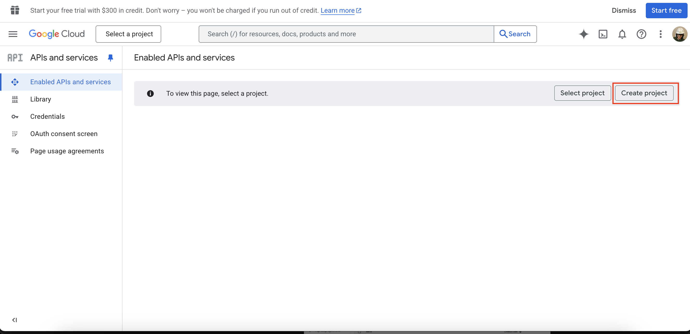
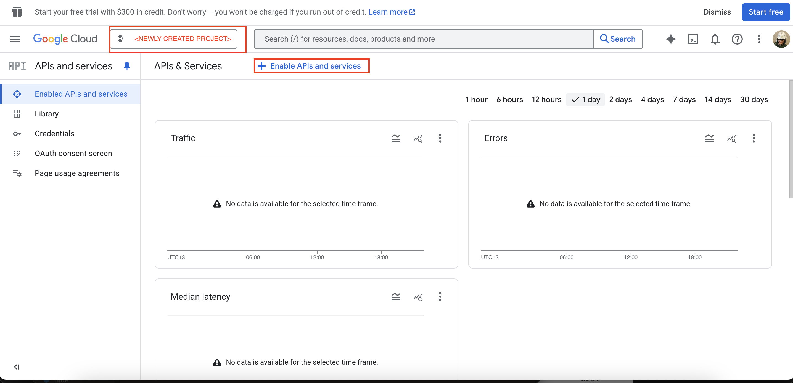
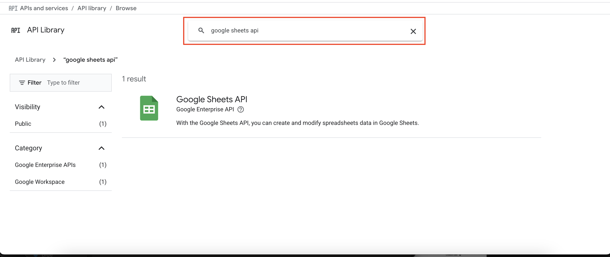
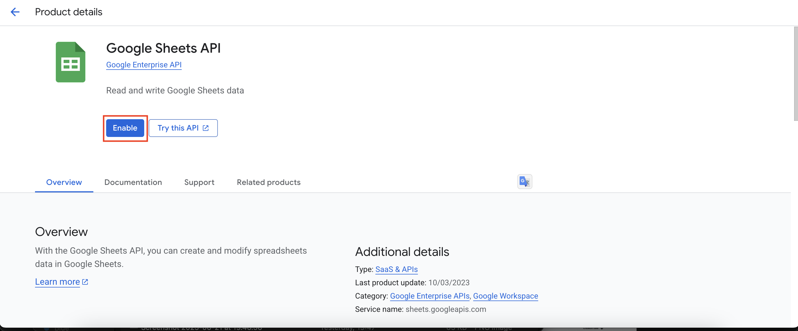
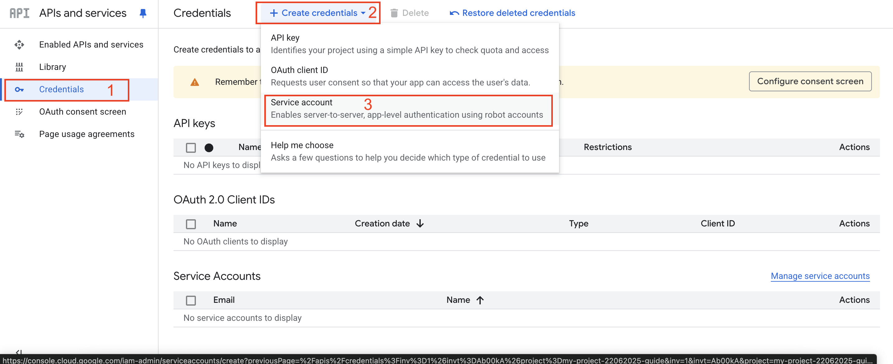
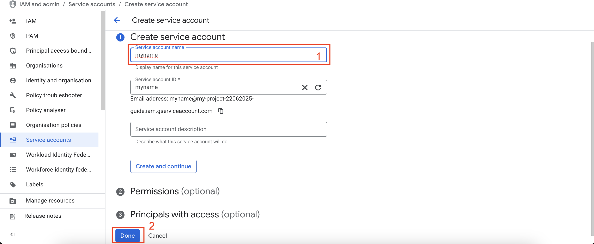
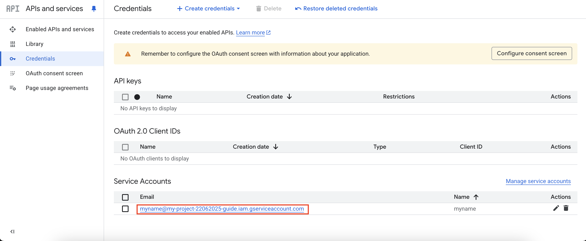
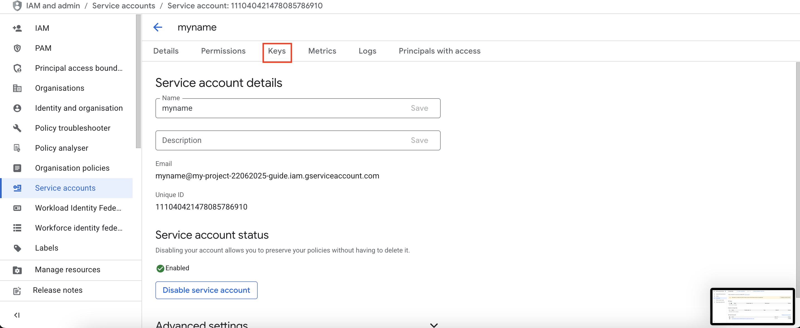
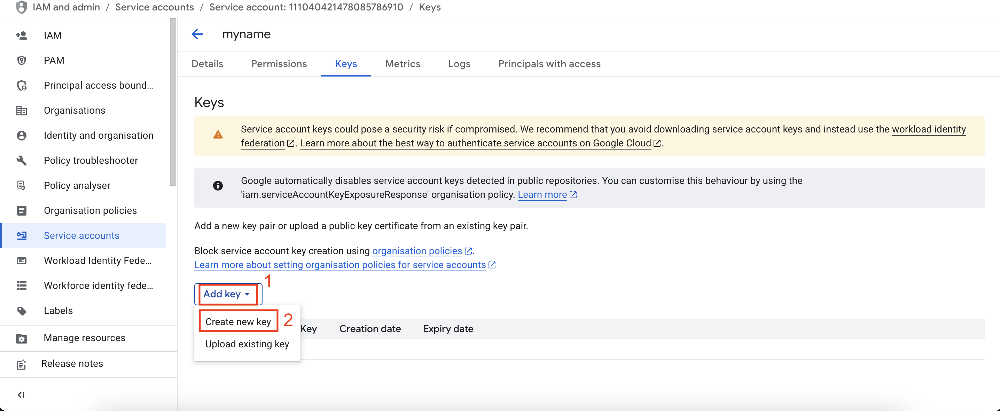
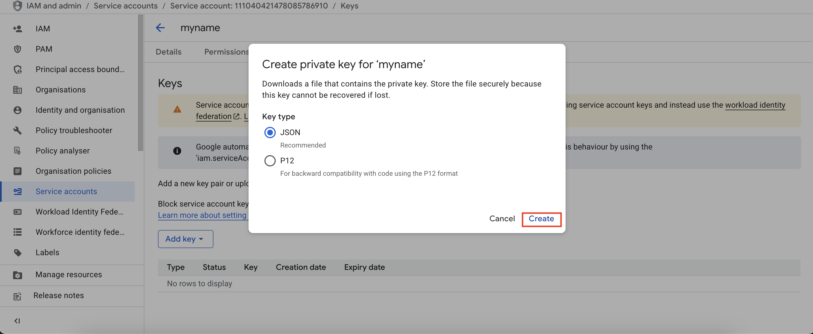

This tutorial demonstrates how to synchronize the results table with a [Google Sheet](https://workspace.google.com/products/sheets/) and optionally upload the default config, stdout, and stderr logs to [Google Drive](https://drive.google.com/drive/my-drive).

## Preliminaries

### Be aware of the quick start guide

Before starting this tutorial, make sure you:

- Understand the gist of [Quick Start Guide](../quick_start_guide/QUICK_START_GUIDE.md).
- Have an [Anaconda](https://www.anaconda.com/) environment with the `stnd` package installed as described [here](../../README.md#installation).

### Prepare service account for Google Sheets and Docs

To write to remote Google Sheets or Drive, you need to create a service account that will handle the writes and have the necessary authorization. For that, please perform these steps:

1. Go to [Google Cloud Console](https://console.cloud.google.com/projectselector2/apis/dashboard)
2. Create a new project
   

   
Screenshot for "Create Project"

   
   

3. [Enable API access](https://docs.gspread.org/en/latest/oauth2.html#enable-api-access) for the following APIs:
- Google Sheets API
- Google Drive API (repeat the same steps as for Google Sheets, but for Google Drive)

    

    
Screenshot for "Enabling APIs"

    
    

    

    
Screenshot for "Enabling Google Sheet API"

    
    
    

4. Navigate to the **Credentials** section

    

    
Screenshot for "Credentials section"

    
    

     
5. Click **"Create credentials"** → **Service account**

    

    
Screenshot for "Create service account"

    
    

     

6. Select newly created Service Account in “Service Accounts” section of credentials page.

    

    
Screenshot for "Selecting new service account"

    
    

     

7. Remember its name e.g. myname@my-project-22062025-guide.iam.gserviceaccount.com in the example screenshot above.
8. Select newly created Service → go to tab Keys of the service page → Add key → Download key as JSON

    

    
Screenshots for "Creating credentials json"

    
    
    
    

     
9. Put the downloaded json with credentials inside `~/.config/gauth/service_key.json`
